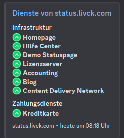
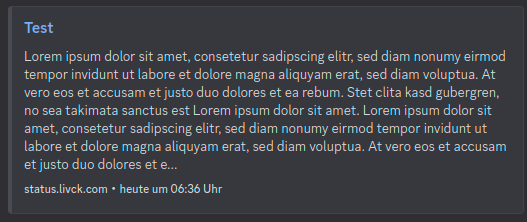

# WIP - LIVCK - Discord Bot for the self-hosted statuspage

The bot can soon be added to your own discord server, it is currently still under development. The bot is intended to provide information about the status of your services and to inform you about news.

IMPORTANT NOTE:
- Private Page Feature currently not supported (later with api tokens useable)
- Cloudflare Bot Shield / Cloudflare Tunnel not supported (generally some proxies with bot protection not supported)
- Design Layout only in German / Command Output in English (Translation Support coming soon)
- No customizations possible (coming soon)

# Sneak Peek

## Status

## News

# TODO
- [ ] Translation Support
- [ ] Custom Config (Emoji, Texts etc.) (config by statuspage -> e.g. statuspage/api/discord/config)
