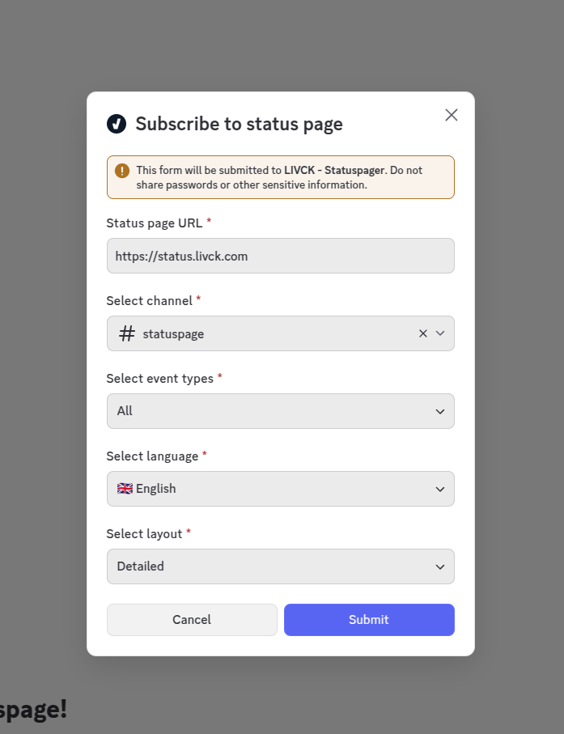
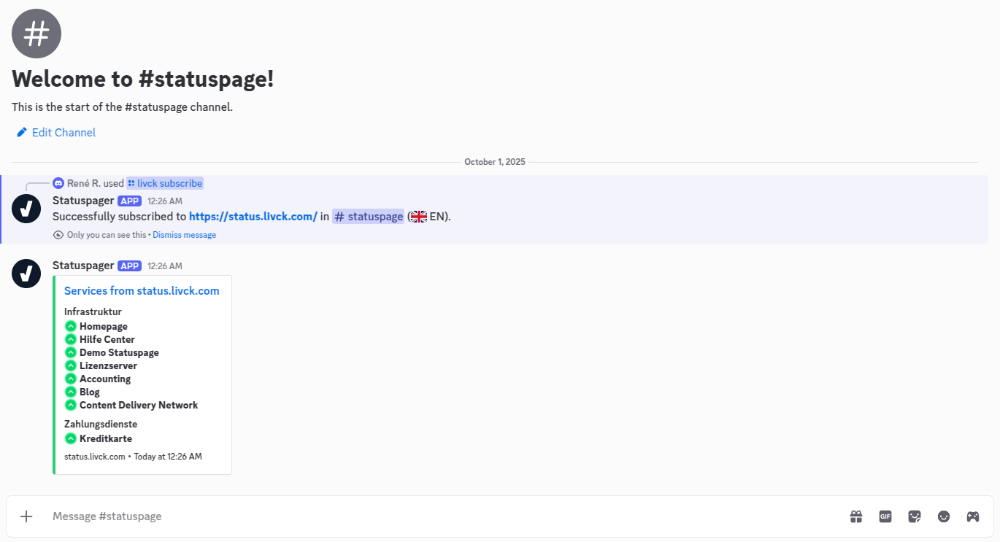
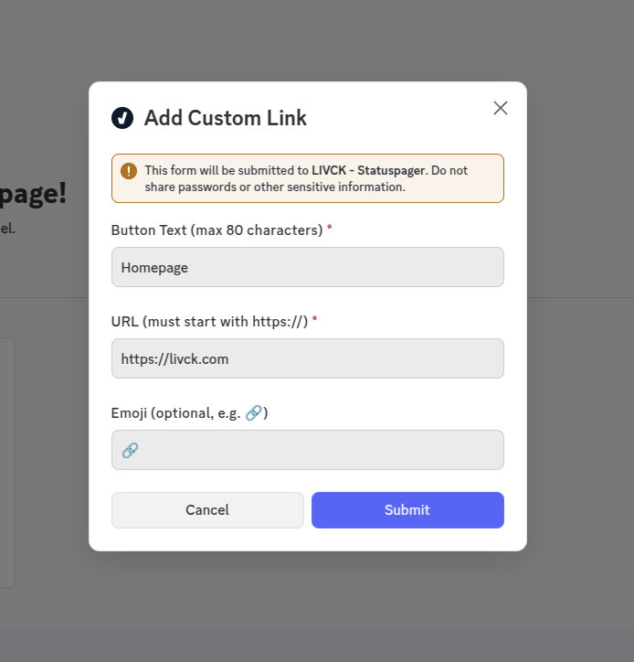
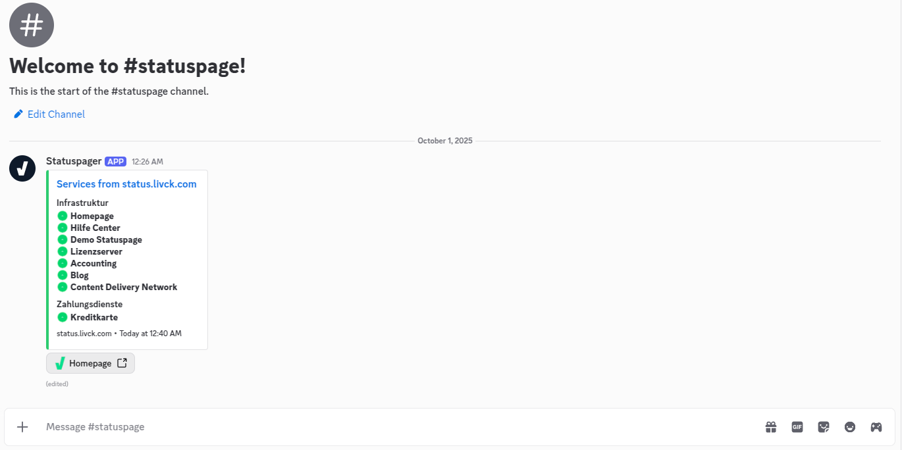
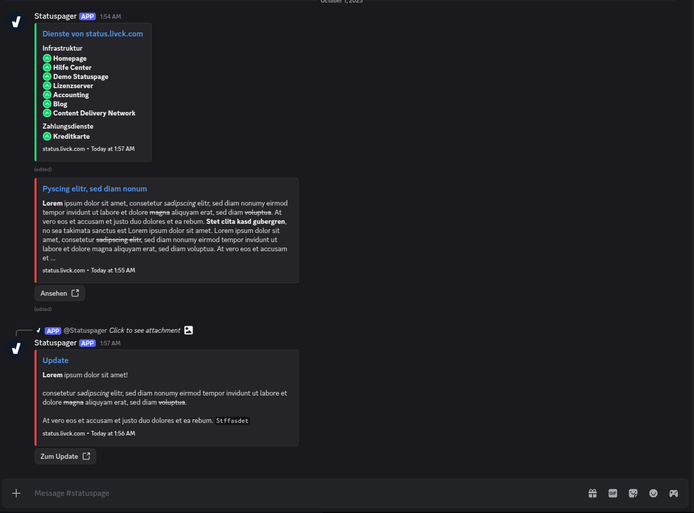

# LIVCK Discord Bot

> **Beam your LIVCK statuspage directly into Discord**

Seamlessly integrate your [LIVCK](https://livck.com) statuspage into your Discord server. Display the complete status of all your services in a Discord channel and keep your community instantly informed about incidents, maintenance, and updates - without ever leaving Discord.

**Works exclusively with LIVCK statuspages** - the self-hosted statuspage and communication platform.

[](https://discord.com/oauth2/authorize?client_id=1315761064520188005)
[](https://livck.com)

---

## 💡 What is LIVCK?

[LIVCK](https://livck.com) is a self-hosted statuspage and communication software that enables transparent, real-time monitoring and communication. Perfect for:
- **Businesses & SaaS** - Keep customers informed about service availability
- **Gaming Communities** - Share server status and updates
- **Development Teams** - Internal service monitoring and incident management
- **Any Organization** - That values transparent communication with stakeholders

### LIVCK Features:
- ✅ **Forever Free Plan** - 20 monitors, 5 categories, 1 member
- 🏠 **Self-Hosted** - Full control over your data (Linux, Windows, macOS)
- 📊 **Real-time Monitoring** - Track service status and uptime
- 📢 **Incident Management** - Communicate outages and maintenance
- 🔔 **Announcements** - Share updates and product changes

This Discord bot extends LIVCK by bringing your entire statuspage directly into Discord, making it even easier to keep your community informed in real-time.

---

## 📋 Table of Contents

- [What is LIVCK?](#-what-is-livck)
- [Features](#-features)
- [Quick Start](#-quick-start)
- [Step-by-Step Guide](#-step-by-step-guide)
  - [1. Add Bot to Server](#1-add-bot-to-your-server)
  - [2. Subscribe to Statuspage](#2-subscribe-to-a-statuspage)
  - [3. Manage Subscriptions](#3-manage-your-subscriptions)
  - [4. Customize Your Setup](#4-customize-your-setup)
- [Features in Detail](#-features-in-detail)
- [Commands](#-commands)
- [Self-Hosting](#-self-hosting)
- [Limitations](#-limitations)
- [Support](#-support)

---

## ✨ Features

### 📊 **Complete Statuspage Integration**
- Display your entire LIVCK statuspage in a Discord channel
- Continuous monitoring with regular status updates
- Persistent messages (edits instead of spam)
- All your public services and categories visible at a glance

### 🚨 **Community Notifications**
Keep your community instantly informed:
- **Incidents** - Automatic notifications when issues occur
- **Maintenance Windows** - Advance notice of planned maintenance
- **Updates** - Real-time status changes posted as threaded replies
- **Announcements** - Important news delivered directly to Discord

Choose what to display:
- Status page only
- Incidents & announcements only
- Both combined

### 🎨 **Layout Customization**
Choose how your status page appears in Discord with 4 different layouts:
- **Detailed** - Full service information with categories (best for comprehensive overview)
- **Compact** - Condensed view for space-saving
- **Overview** - Quick status summary
- **Minimal** - Ultra-compact single-line view

### 🌐 **Multi-Language Support**
Display your statuspage in your community's language:
- 🇩🇪 German (Deutsch)
- 🇬🇧 English
- 🌍 **More languages coming soon** via [Crowdin](https://crowdin.com) - we're building a community-driven translation platform for this open-source project!

Switch languages anytime - all messages update instantly!

### 🔗 **Custom Links**
Add custom buttons to your status messages for quick access:
- Homepage links
- Documentation portals
- Support channels
- Status page link
- Any custom URL with emoji support

### ⚙️ **Flexible Subscriptions**
- Multiple status pages per Discord server
- Different channels for different status pages
- Choose specific event types per channel
- Easy management through Discord commands

---

## 🚀 Quick Start

1. **[Invite the bot](https://discord.com/oauth2/authorize?client_id=1315761064520188005)** to your Discord server
2. Run `/livck subscribe` in the channel where you want your statuspage
3. Enter your LIVCK statuspage URL (e.g., `status.livck.com`)
4. Choose what to display (statuspage, incidents, or both)
5. Select your preferred language and layout
6. Done! Your complete statuspage is now live in Discord and updates automatically

---

## 📖 Step-by-Step Guide

### 1. Add Bot to Your Server

Click the invite link and select your Discord server:

[](https://discord.com/oauth2/authorize?client_id=1315761064520188005)

**Required Permissions:**
- View Channels
- Send Messages
- Embed Links
- Read Message History

---

### 2. Subscribe to a Statuspage

Use the `/livck subscribe` command to add a statuspage to your Discord channel.



**Enter the required information:**
- **Statuspage URL**: Your LIVCK statuspage (e.g., `status.livck.com` or `https://status.yourdomain.com`)
- **Event Types**:
  - `All` - Status updates + News/Incidents
  - `Status Only` - Only service status
  - `News Only` - Only incidents and maintenance
- **Language**: German (🇩🇪) or English (🇬🇧)
- **Layout**: Choose from Detailed, Compact, Overview, or Minimal



---

### 3. Manage Your Subscriptions

#### View All Subscriptions
Use `/livck list` to see all active subscriptions in your server.

#### Edit a Subscription
Click the **Edit** button in the list to modify:
- Language (DE/EN)
- Layout style
- Manage custom links

#### Delete a Subscription
Click the **Delete** button to remove a subscription from a channel.

---

### 4. Customize Your Setup

#### Add Custom Links

Enhance your status messages with custom buttons:

1. Run `/livck list` and click **Edit** on your subscription
2. Click **Manage Links**
3. Click **Add Link**



**Enter link details:**
- **Label**: Button text (e.g., "Homepage", "Support")
- **URL**: Full URL (e.g., `https://livck.com`)
- **Emoji** (optional): Unicode emoji (e.g., 🏠, 📖) or custom Discord emoji



**Features:**
- Up to 25 custom links per subscription
- Reorder links with Move Up/Down buttons
- Edit or delete existing links
- Links appear as buttons below your status message

---

## 🎯 Features in Detail

### Complete Statuspage in Discord

Your entire LIVCK statuspage is displayed directly in Discord with continuous monitoring:

- **All Public Services**: Every public service from your statuspage visible in Discord
- **Public Categories**: Organized view matching your statuspage structure
- **Real-Time Status**: Color-coded indicators showing operational status
- **Continuous Updates**: Changes on your statuspage appear in Discord automatically

**Note:** Private monitors and categories are not displayed in Discord - only public content is synchronized.

This means your community can check your service status without leaving Discord - perfect for gaming servers, SaaS communities, or any project with a Discord presence.



### Layout Comparison

| Layout | Best For | Features |
|--------|----------|----------|
| **Detailed** | Full information | Categories, all services, detailed status |
| **Compact** | Space-saving | Condensed view, essential info only |
| **Overview** | Quick glance | Summary of overall status |
| **Minimal** | Minimal footprint | Single-line ultra-compact display |

### Keeping Your Community Informed

When incidents, maintenance, or announcements occur on your status page:

1. **Instant Notifications**: Automatically posted to your Discord channel
2. **Incident Updates**: New updates are posted as threaded replies to keep everything organized
3. **Automatic Cleanup**: Alerts older than 3 days are automatically archived
4. **No Spam**: Updates edit existing messages instead of creating duplicates

This ensures your community is always up-to-date without cluttering your Discord channels.

### Language System

Serve international communities by switching between German and English:
- All status messages instantly update to the new language
- Perfect for bilingual communities or international projects
- Complete translation of all status information and UI elements

---

## 💬 Commands

| Command | Description |
|---------|-------------|
| `/livck subscribe` | Subscribe a channel to a LIVCK statuspage |
| `/livck list` | View all subscriptions and manage them |
| `/livck unsubscribe` | Remove a subscription (also available via list) |
| `/ping` | Check bot response time |

---

## 🏠 Self-Hosting

While we provide a hosted version, you're free to self-host the bot.

### Requirements

- **Node.js** 22.9.0 or higher
- **MariaDB** / MySQL database
- **Redis** server
- **Discord Bot Token**

### Quick Setup

1. **Clone the repository:**
   ```bash
   git clone https://github.com/yourusername/livck-discord-bot.git
   cd livck-discord-bot
   ```

2. **Install dependencies:**
   ```bash
   npm install
   ```

3. **Configure environment:**
   ```bash
   cp .env.example .env
   # Edit .env with your credentials
   ```

4. **Run database migrations:**
   ```bash
   node migrate.js
   ```

5. **Start the bot:**
   ```bash
   node server.js
   ```

### Environment Variables

See `.env.example` for all required configuration options:

- `DISCORD_CLIENT_ID`, `DISCORD_CLIENT_SECRET`, `DISCORD_BOT_TOKEN`
- `DB_HOST`, `DB_DATABASE`, `DB_USERNAME`, `DB_PASSWORD`
- `REDIS_HOST`, `REDIS_PORT`, `REDIS_PASSWORD`
- Optional custom emoji IDs for status indicators

---

## ⚠️ Limitations

### Current Restrictions

- **Private Statuspages**: Not yet supported - planned for future releases
- **Private Monitors/Categories**: Not displayed in Discord - only public content is synchronized
- **Cloudflare Protection**: Bot shield and tunnels may block the bot
- **Proxy Compatibility**: Some proxies with aggressive bot protection not supported

### Workarounds

If your statuspage is behind Cloudflare or similar protection:
1. Whitelist the bot's IP address
2. Disable bot protection for the statuspage API endpoints
3. Use a self-hosted instance with custom IP

---

## 💡 Support

### Need Help?

- **Discord Community**: [discord.livck.com](https://discord.livck.com)
- **Email Support**: [support@livck.com](mailto:support@livck.com)
- **Documentation**: [LIVCK Documentation](https://help.livck.com)
- **LIVCK Website**: [livck.com](https://livck.com)

### Found a Bug?

Please report bugs via GitHub Issues with:
- Steps to reproduce
- Expected vs actual behavior
- Screenshots if applicable
- Your statuspage URL (if public)

---

## 📜 License

This project is licensed under the **MIT License** - see the LICENSE file for details.

Feel free to contribute or fork for your own needs!

---

## 🙏 Credits

Built with ❤️ for the LIVCK community.

- **LIVCK**: [livck.com](https://livck.com)
- **Discord.js**: Powerful Discord bot framework
- **Node.js**: JavaScript runtime

---

**Ready to get started?**

[](https://discord.com/oauth2/authorize?client_id=1315761064520188005)
